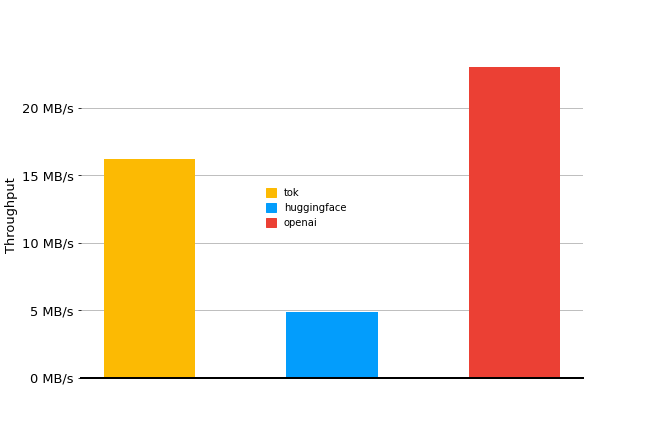

# 🪙 toktokenizer
toktokenizer is a [BPE](https://en.wikipedia.org/wiki/Byte_pair_encoding) tokenizer implemented in rust and exposed in python using [pyo3](https://github.com/PyO3/pyo3) bindings. 

```python 
import toktokenizer as tok
bpe = tok.BPETokenizer.from_pretrained("wikibpe.json")
assert bpe.decode(bpe.encode("rust is pretty fun 🦀"))
```

Install `toktokenizer` from PyPI with the following
```
pip install toktokenizer
```
**Note:** make sure you have Rust installed to build from the sdist 

# Performance 
not the greatest but also not the worst! 



Performance measured on 2.5MB from the [wikitext](https://huggingface.co/datasets/wikitext) test split using openai's [tiktoken gpt2 tokenizer](https://github.com/openai/tiktoken) with `tiktoken==0.6.0` and the [implementation from 🤗 tokenizers](https://huggingface.co/openai-community/gpt2) at `tokenizers==0.19.1`
